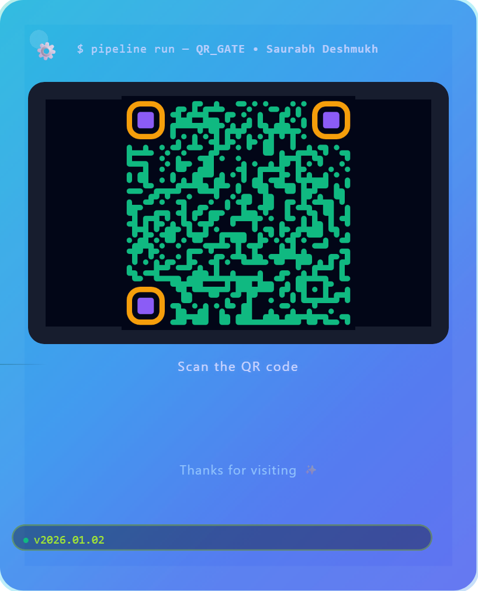

# Digital Coordinates - Portfolio & QR Code Project

A modern, animated portfolio website with an interactive QR code generator for sharing your professional profile.

## 📱 Quick Access - Scan to Visit Portfolio

<div align="center">
  


### 📲 Scan this QR code to visit the live portfolio!

🔗 Or click here: [https://even-tempered.github.io/digital-coordinate/](https://even-tempered.github.io/digital-coordinate/)

</div>

---

## 📁 Project Structure

```
digital-coordinate/
├── index.html          # Main portfolio page
├── qr.html            # QR code generator page
└── README.md          # This file
```

---

## 🎯 What This Project Does

### 1. **Portfolio Website** (`index.html`)
A beautiful, responsive personal portfolio showcasing your DevOps/Cloud engineering skills.

**Features:**
- ✨ **Modern Design**: Blue/purple gradient theme with smooth animations
- 🎨 **Sections Include**:
  - Hero section with your name and tagline
  - "What I Build" - Your technical skills (AWS, Terraform, CI/CD)
  - "How I Work" - Your working methodology
  - "Automation & AI" - Your expertise in automation and AI
  - Coordinates section (Cloud, AI, Monitoring)
  - Social media links (LinkedIn, GitHub, Instagram)
- 📱 **Fully Responsive**: Works perfectly on desktop, tablet, and mobile
- 🌟 **Animations**: Fade-ins, hover effects, parallax scrolling

### 2. **QR Code Generator** (`qr.html`)
An animated card that generates a scannable QR code linking to your portfolio.

**Features:**
- 📱 **Interactive QR Code**: Scans to your portfolio URL
- 🎨 **Branded Design**: 
  - Spinning gear logo
  - Terminal-style header
  - Animated tech badges (Terraform, AWS, etc.)
  - Gradient background with floating particles
- 💾 **Two Download Options**:
  - **"QR Only"** - Downloads just the QR code (600x600px PNG)
  - **"Full Card"** - Downloads the entire branded card with logo, QR, badges, and animations
- ⚙️ **High Quality**: 600x600px resolution with high error correction
- 🎭 **Animated Elements**: 
  - Floating/pulsing effects
  - Gradient shifts
  - Glow effects on hover

---

## 🚀 How to Use

### View Portfolio:
1. Open `index.html` in any web browser
2. Scroll through your professional profile
3. Click social media links to visit profiles

### Generate QR Code:
1. Open `qr.html` in any web browser
2. The QR code appears automatically
3. Scan with your phone to test it
4. Click **"QR Only"** to download just the QR code
5. Click **"Full Card"** to download the complete branded image

### Share Your Profile:
- Use the downloaded QR card on:
  - Business cards
  - Email signatures
  - LinkedIn posts
  - Conference slides
  - Instagram stories
  - Print materials

---

## 🎨 Design Elements

### Color Scheme:
- **Primary**: Deep blue (#3b82f6), Purple (#8b5cf6), Cyan (#06b6d4)
- **Accents**: Emerald green (#10b981), Amber (#f59e0b), Pink (#ec4899)
- **Background**: Dark navy (#0f0f23) with gradient overlays

### Animations:
- Smooth fade-ins on scroll
- Gradient color shifts
- Hover scale effects
- Pulsing glows
- Floating particles
- Rotating icons

---

## 🛠️ Technologies Used

- **HTML5** - Structure
- **CSS3** - Styling with advanced animations
- **Vanilla JavaScript** - Interactivity (no frameworks needed!)
- **QR Code Styling Library** - Beautiful, customizable QR codes
- **html2canvas** - Capture full card as image
- **Google Fonts** - Inter font family

---

## 📝 Customization

### Update Your Information:
1. **Portfolio** (`index.html`):
   - Change name in `<h1>` tag
   - Update tagline and subtitle
   - Modify social media links
   - Adjust skills and experience text

2. **QR Code** (`qr.html`):
   - Update `QR_URL` variable with your portfolio link
   - Change your name in the terminal header
   - Modify badges to match your tech stack
   - Adjust colors in CSS `:root` variables

### Add Your Logo:
In `qr.html`, update the `LOGO_URL` variable:
```javascript
const LOGO_URL = "https://your-domain.com/your-logo.png";
```

---

## 🌐 Deployment

### GitHub Pages (Free):
1. Create a new GitHub repository
2. Upload `index.html` and `qr.html`
3. Go to Settings → Pages
4. Select main branch → Save
5. Your site will be live at: `https://username.github.io/repo-name/`

### Other Options:
- **Netlify**: Drag & drop your files
- **Vercel**: Connect your GitHub repo
- **Surge**: Command-line deployment

---

## 💡 Use Cases

### Portfolio Site:
- Job applications
- Networking events
- LinkedIn profile link
- Personal branding

### QR Code:
- Business cards (print the card)
- Conference badges
- Email signatures (attach image)
- Social media bios
- Presentation slides
- Printed portfolios

---

## 📊 File Sizes

- `index.html`: ~30KB (standalone, no dependencies)
- `qr.html`: ~20KB + external libraries
- QR downloads: 
  - QR Only: ~15-25KB
  - Full Card: ~50-80KB

---

## 🔧 Browser Support

- ✅ Chrome/Edge (latest)
- ✅ Firefox (latest)
- ✅ Safari (latest)
- ✅ Mobile browsers (iOS/Android)

---

## 📄 License

This project is open source. Feel free to use, modify, and share!

---

## 👨‍💻 Author

**Saurabh Deshmukh**
- Cloud & DevOps Engineer
- Automation & Infrastructure

---

## 🎉 Final Thoughts

This project combines **beautiful design** with **practical functionality**. The portfolio showcases your skills professionally, while the QR code makes it super easy to share your profile anywhere!

---

Made with ☕ and lots of gradients 🌈
